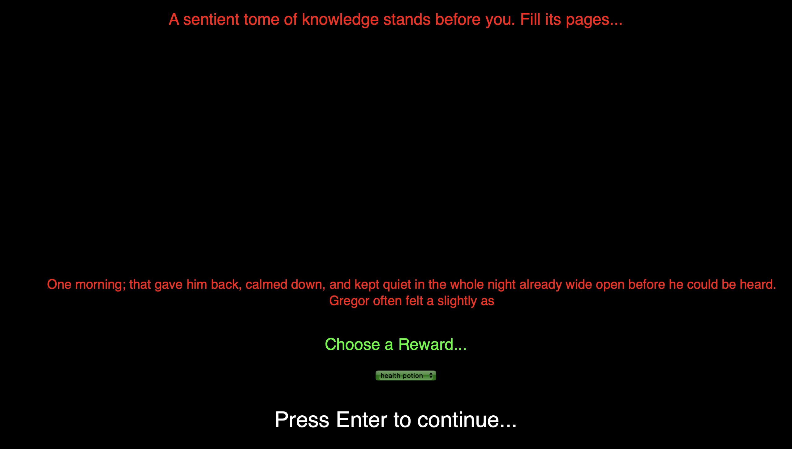

# ShapeNarrativeMarkov
Improvement of Shape Narrative

This Website was made with P5 and allows you to play through an adventure narrative as a questing square in a land of circular heathens.

Rules:
1. Enter commands (attack/use/drop) followed by exactly one space and then the target that you are acting on. Click the submit button when you wish to act on a command.
1. Watch both your health and your fuel wisely. They will be depleted for every action you take and if either drop to zero, the circles will reign victorious.
1. Collect loot by selecting an item from the drop-down menu and pressing enter to continue to the next level.

Note: All text files that the markov chains are based off of were obtained from the Gutenberg Project.
Additionally, the markov texts themselves were generated with programs written by Daniel Shiffman.

